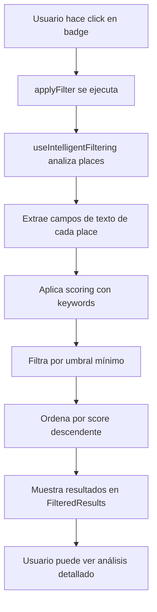

# 🧠 Sistema de Filtrado Inteligente

## 📋 Descripción General

El **Sistema de Filtrado Inteligente** es una funcionalidad avanzada que permite filtrar lugares (hoteles, playas, restaurantes, parques) basándose en el análisis semántico de su contenido. Utiliza badges interactivos para aplicar filtros que analizan múltiples propiedades de cada lugar y devuelve resultados ordenados por relevancia.

## 🎯 ¿Para qué sirve?

- **Búsqueda Semántica**: Encuentra lugares basándose en el significado del contenido, no solo en palabras clave exactas
- **Filtrado Inteligente**: Analiza descripciones, amenities, servicios y reviews para determinar relevancia
- **Experiencia de Usuario**: Permite a los usuarios encontrar lugares específicos con un solo click en un badge
- **Escalabilidad**: Sistema reutilizable para cualquier categoría de lugares

## 🏗️ Arquitectura del Sistema

### Componentes Principales

```
📁 Sistema de Filtrado Inteligente
├── 🧠 useIntelligentFiltering.ts (Hook principal)
├── ⚙️ useIntelligentFilteringConfig.ts (Configuraciones)
├── 🎨 FilterableContent.tsx (Componente de contenido)
├── 📊 FilteredResults.tsx (Componente de resultados)
└── 📄 Páginas de categorías (HotelesPage, PlayasPage, etc.)
```

## 🔧 Configuración de Filtros

### Estructura de Configuración

```typescript
// useIntelligentFilteringConfig.ts
export const INTELLIGENT_FILTER_CONFIGS = {
  hotels: {
    spa: {
      keywords: {
        primary: ['spa', 'relajación', 'masaje', 'bienestar', 'terapéutico'],
        secondary: ['sauna', 'vapor', 'calor', 'aromaterapia'],
        amenities: ['spa', 'wellness center', 'massage', 'jacuzzi']
      },
      weight: 1.0,
      category: 'wellness'
    }
    // ... más filtros
  }
  // ... más categorías
};
```

### Propiedades de Filtro

| Propiedad | Tipo | Descripción |
|-----------|------|-------------|
| `keywords.primary` | `string[]` | Palabras clave principales (peso alto) |
| `keywords.secondary` | `string[]` | Palabras clave secundarias (peso medio) |
| `keywords.amenities` | `string[]` | Amenities específicos (peso muy alto) |
| `weight` | `number` | Peso general del filtro |
| `category` | `string` | Categoría del filtro para agrupación |

## 🎯 Propiedades de Place Analizadas

### Campos Principales (Peso Alto)
- **`name`**: Nombre del lugar
- **`vicinity`**: Zona/barrio
- **`formatted_address`**: Dirección completa
- **`editorial_summary.overview`**: Descripción editorial

### Amenities (Peso Muy Alto)
- **`amenities[]`**: Lista de comodidades del lugar
- **`services[]`**: Servicios disponibles
- **`types[]`**: Tipos de lugar (lodging, restaurant, spa, etc.)

### Información de Contacto
- **`website`**: Sitio web
- **`formatted_phone_number`**: Teléfono formateado
- **`international_phone_number`**: Teléfono internacional

### Información Adicional
- **`lodging_info`**: Información específica de alojamiento
- **`reviews[].text`**: Texto de las reseñas

## 🧮 Sistema de Scoring

### Pesos por Categoría

```typescript
const scoringWeights = {
  primary: { primary: 3, secondary: 1, amenities: 0 },
  amenities: { primary: 4, secondary: 1.5, amenities: 5 },
  services: { primary: 2.5, secondary: 1, amenities: 0 },
  contact: { primary: 1.5, secondary: 0.5, amenities: 0 },
  lodging: { primary: 2, secondary: 1, amenities: 0 },
  reviews: { primary: 1.5, secondary: 0.5, amenities: 0 }
};
```

### Cálculo de Score

1. **Análisis por Campo**: Cada campo se analiza con sus keywords correspondientes
2. **Multiplicadores**: Cada tipo de keyword tiene un multiplicador diferente
3. **Bonus por Múltiples Coincidencias**: +2 puntos si hay 3+ coincidencias primarias
4. **Score Final**: `(totalScore + bonusScore) * filterWeight`

### Umbrales de Calidad

- **Alta Calidad**: Score ≥ 3.0
- **Calidad Media**: Score 1.5 - 2.9
- **Calidad Baja**: Score 1.0 - 1.4
- **Sin Relevancia**: Score < 1.0 (filtrado)

## 🚀 Uso del Sistema

### 1. Implementación Básica

```typescript
import { useIntelligentFiltering } from '../../hooks/useIntelligentFiltering';

const MyPage = () => {
  const { places } = usePlaces({ category: "hotels" });
  
  const {
    places: filteredPlaces,
    totalMatches,
    activeFilter,
    applyFilter,
    clearFilter,
    isFilterActive,
    qualityAnalysis,
    analyzeContentMatch
  } = useIntelligentFiltering(places, 'hotels');

  const handleBadgeClick = (badgeId: string) => {
    if (badgeId !== "todo") {
      applyFilter(badgeId);
    } else {
      clearFilter();
    }
  };

  return (
    <div>
      {/* Badges */}
      <div className="badges">
        {BADGE_CONFIG.map(badge => (
          <BadgeWithIcon
            key={badge.id}
            id={badge.id}
            label={badge.label}
            isActive={activeFilter === badge.id}
            onClick={() => handleBadgeClick(badge.id)}
          />
        ))}
      </div>

      {/* Contenido Principal */}
      <FilterableContent isVisible={!isFilterActive}>
        <MainContent places={places} />
      </FilterableContent>

      {/* Resultados Filtrados */}
      <FilterableContent isVisible={isFilterActive}>
        <FilteredResults
          places={filteredPlaces}
          filterName={getFilterName(activeFilter)}
          totalMatches={totalMatches}
          qualityAnalysis={qualityAnalysis}
          onPlaceClick={(place) => {
            console.log('Lugar seleccionado:', place);
            if (activeFilter) {
              const analysis = analyzeContentMatch(place, activeFilter);
              console.log('Análisis de contenido:', analysis);
            }
          }}
        />
      </FilterableContent>
    </div>
  );
};
```

### 2. Configuración de Badges

```typescript
const BADGE_CONFIG = [
  { id: "todo", icon: "todo_icon.svg", label: "Todo" },
  { id: "spa", icon: "spa_icon.svg", label: "Spa" },
  { id: "gym", icon: "gym_icon.svg", label: "Gym" },
  { id: "rest", icon: "rest_icon.svg", label: "Restaurante" }
];
```

### 3. Análisis de Contenido

```typescript
// Obtener análisis detallado de por qué un lugar coincide
const analysis = analyzeContentMatch(place, 'spa');

console.log(analysis);
// Output:
// {
//   name: { text: "Hotel Spa Resort", matches: ["spa"] },
//   address: { text: "Zona Spa", matches: ["spa"] },
//   description: { text: "Centro de bienestar...", matches: ["bienestar"] },
//   amenities: { text: "spa, jacuzzi, sauna", matches: ["spa", "jacuzzi"] },
//   services: { text: "wellness, massage", matches: ["wellness"] }
// }
```

## 📊 Métricas y Análisis

### Estadísticas de Filtrado

```typescript
const stats = getFilterStats();
console.log(stats);
// Output:
// {
//   filterName: "spa",
//   category: "wellness",
//   totalKeywords: 15,
//   primaryKeywords: ["spa", "relajación", "masaje"],
//   secondaryKeywords: ["sauna", "vapor", "calor"],
//   amenityKeywords: ["spa", "wellness center", "massage"]
// }
```

### Análisis de Calidad

```typescript
const { qualityAnalysis } = useIntelligentFiltering(places, 'hotels');

console.log(qualityAnalysis);
// Output:
// {
//   high: 5,    // 5 lugares de alta calidad
//   medium: 8, // 8 lugares de calidad media
//   low: 3      // 3 lugares de calidad baja
// }
```

## 🔧 Mantenimiento y Extensión

### Agregar Nueva Categoría

1. **Agregar configuración en `useIntelligentFilteringConfig.ts`**:

```typescript
export const INTELLIGENT_FILTER_CONFIGS = {
  // ... categorías existentes
  museums: {
    art: {
      keywords: {
        primary: ['arte', 'art', 'pintura', 'escultura'],
        secondary: ['cultura', 'historia', 'exposición'],
        amenities: ['art gallery', 'museum', 'exhibition']
      },
      weight: 1.0,
      category: 'culture'
    }
  }
};
```

2. **Crear página de categoría**:

```typescript
const MuseumsPage = () => {
  const { places } = usePlaces({ category: "museums" });
  const filtering = useIntelligentFiltering(places, 'museums');
  
  // ... implementación similar a HotelesPage
};
```

### Agregar Nuevo Filtro

1. **Agregar configuración**:

```typescript
hotels: {
  // ... filtros existentes
  pet_friendly: {
    keywords: {
      primary: ['pet friendly', 'mascotas', 'perros', 'gatos'],
      secondary: ['animales', 'veterinario', 'cuidado'],
      amenities: ['pet friendly', 'dog park', 'pet care']
    },
    weight: 1.0,
    category: 'amenities'
  }
}
```

2. **Agregar badge**:

```typescript
const BADGE_CONFIG = [
  // ... badges existentes
  { id: "pet_friendly", icon: "pet_icon.svg", label: "Pet Friendly" }
];
```

### Optimizar Keywords

```typescript
// Agregar más variaciones para mejor cobertura
spa: {
  keywords: {
    primary: [
      'spa', 'relajación', 'masaje', 'bienestar', 'terapéutico',
      'hidroterapia', 'jacuzzi', 'wellness', 'zen', 'meditación'
    ],
    secondary: [
      'sauna', 'vapor', 'calor', 'aromaterapia', 'yoga', 'pilates',
      'tranquilidad', 'serenidad', 'armonía'
    ],
    amenities: [
      'spa', 'wellness center', 'massage', 'jacuzzi', 'sauna',
      'steam room', 'relaxation', 'therapy', 'meditation'
    ]
  }
}
```

## 🐛 Debugging y Troubleshooting

### Verificar Configuración

```typescript
// Verificar si un filtro existe
const exists = filterExists('hotels', 'spa');
console.log('Filtro spa existe:', exists);

// Obtener filtros disponibles
const available = getAvailableFilters('hotels');
console.log('Filtros disponibles:', available);
```

### Analizar Resultados

```typescript
// Ver por qué un lugar no aparece en resultados
const place = places[0];
const analysis = analyzeContentMatch(place, 'spa');
console.log('Análisis del lugar:', analysis);

// Verificar score manualmente
const score = analyzePlaceContent(place, getFilterConfig('hotels', 'spa'));
console.log('Score del lugar:', score);
```

### Logs de Debugging

```typescript
// Habilitar logs detallados
const filtering = useIntelligentFiltering(places, 'hotels');

// En el componente
useEffect(() => {
  if (activeFilter) {
    console.log('Filtro activo:', activeFilter);
    console.log('Lugares filtrados:', filteredPlaces.length);
    console.log('Análisis de calidad:', qualityAnalysis);
  }
}, [activeFilter, filteredPlaces, qualityAnalysis]);
```

## 📈 Mejores Prácticas

### 1. Keywords Efectivas
- **Usar sinónimos**: Incluir variaciones de la misma palabra
- **Contexto específico**: Keywords que describan el uso real
- **Idiomas**: Incluir términos en español e inglés
- **Amenities reales**: Basarse en amenities reales de Google Places

### 2. Pesos Balanceados
- **Primary**: 3-4x peso (términos más importantes)
- **Secondary**: 1-2x peso (términos relacionados)
- **Amenities**: 5x peso (muy específicos y confiables)

### 3. Testing
- **Probar con datos reales**: Usar lugares reales para validar
- **Verificar edge cases**: Lugares sin amenities, con poca información
- **Ajustar umbrales**: Modificar `minScore` según necesidades

### 4. Performance
- **Memoización**: El hook usa `useMemo` para optimizar
- **Caching**: Los resultados se cachean automáticamente
- **Lazy loading**: Solo se ejecuta cuando hay filtro activo

## 🔄 Flujo de Funcionamiento



## 🎉 Conclusión

El **Sistema de Filtrado Inteligente** proporciona una experiencia de búsqueda avanzada que va más allá de las búsquedas por texto simple. Al analizar múltiples propiedades de cada lugar y aplicar un sistema de scoring sofisticado, los usuarios pueden encontrar exactamente lo que buscan con un solo click.

El sistema es completamente reutilizable, escalable y fácil de mantener, permitiendo agregar nuevas categorías y filtros sin modificar el código existente.
