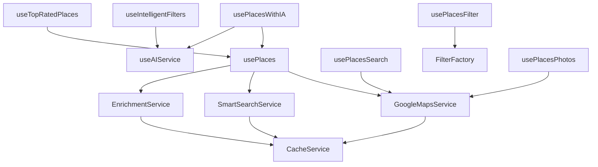

# 🗺️ Sistema de Lugares (Places) - Guía Completa para Desarrolladores

## 📋 Índice
1. [Introducción](#introducción)
2. [Arquitectura del Sistema](#arquitectura-del-sistema)
3. [Estructura de Carpetas](#estructura-de-carpetas)
4. [Hooks Principales](#hooks-principales)
5. [Servicios](#servicios)
6. [Configuraciones](#configuraciones)
7. [Ejemplos de Uso](#ejemplos-de-uso)
8. [Casos de Uso Comunes](#casos-de-uso-comunes)
9. [Mejores Prácticas](#mejores-prácticas)

---

## 🎯 Introducción

El sistema `@places/` es un conjunto completo de hooks, servicios y utilidades para gestionar lugares usando Google Places API. Permite buscar, filtrar, enriquecer y analizar lugares con inteligencia artificial.

### 🚀 Características Principales
- **Búsqueda inteligente** de lugares por categoría
- **Enriquecimiento de datos** con información detallada
- **Filtros avanzados** con IA
- **Geolocalización** automática
- **Caché inteligente** para optimizar rendimiento
- **Análisis de sentimientos** en reviews
- **Detección de amenities** automática

---

## 🏗️ Arquitectura del Sistema



---

## 📁 Estructura de Carpetas

### 🎯 **Hooks Principales**
```
src/hooks/places/
├── usePlaces.ts              # Hook principal para buscar lugares
├── usePlacesWithIA.ts        # Hook con análisis de IA
├── usePlacesSearch.ts        # Hook para búsquedas específicas
├── usePlacesFilter.ts        # Hook para filtros
└── useTopRatedPlaces.ts      # Hook para lugares mejor valorados
```

### 🔧 **Servicios**
```
services/
├── GoogleMapsService.ts      # Servicio principal de Google Maps
├── SmartSearchService.ts     # Búsqueda inteligente por categorías
├── EnrichmentService.ts      # Enriquecimiento de datos de lugares
└── CacheService.ts           # Sistema de caché
```

### ⚙️ **Configuraciones**
```
config/
└── categoryConfigs.ts        # Configuraciones por categoría

enrichment/
└── enrichmentConfigs.ts     # Configuraciones de enriquecimiento
```

### 🤖 **Inteligencia Artificial**
```
ai/
└── useAIService.ts           # Servicio de IA para análisis
```

### 🔍 **Filtros y Búsqueda**
```
filter/
├── filterFactory.ts          # Factory para crear filtros
└── filterStrategies.ts       # Estrategias de filtrado

filters/
└── useIntelligentFilters.ts  # Filtros inteligentes con IA

search/
├── usePlacesSearch.ts        # Hook de búsqueda
└── searchStrategies.ts       # Estrategias de búsqueda
```

### 🖼️ **Fotos y Procesamiento**
```
photos/
└── usePlacesPhotos.ts        # Gestión de fotos de lugares

processors/
└── reviewsProcessor.ts       # Procesamiento de reviews
```

### 🛠️ **Utilidades y Base**
```
base/
├── useGoogleMaps.ts          # Hook para Google Maps
└── useGeolocation.ts        # Hook para geolocalización

utils/
└── PlaceUtils.ts            # Utilidades para lugares

topRated/
├── useTopRatedPlaces.ts     # Hook para top rated
└── index.ts                 # Exports
```

---

## 🎣 Hooks Principales

### 1. **`usePlaces`** - Hook Principal

**Propósito**: Buscar lugares por categoría con enriquecimiento opcional.

```typescript
const { places, mapCenter, loading, status, error } = usePlaces({
  category: "beaches",           // Categoría de lugares
  searchQuery?: "playa bonita",  // Búsqueda específica (opcional)
  enableEnrichment?: true,      // Habilitar enriquecimiento (default: true)
  maxResults?: 20,              // Máximo de resultados (default: 20)
  fallbackLocation?: {          // Ubicación de respaldo (opcional)
    lat: -12.0464, 
    lng: -77.0428 
  }
});
```

**Retorna**:
- `places`: Array de lugares enriquecidos
- `mapCenter`: Centro del mapa
- `loading`: Estado de carga
- `status`: Mensaje de estado
- `error`: Error si existe

### 2. **`usePlacesWithIA`** - Hook con IA

**Propósito**: Buscar lugares con análisis de inteligencia artificial.

```typescript
const { places, filteredPlaces, loading, aiAnalysis } = usePlacesWithIA({
  category: "restaurants",
  searchQuery?: "comida peruana",
  requestedFilters: ["luxury", "beach", "petfriendly"],
  enableAI: true,
  maxPlaces: 20
});
```

### 3. **`useTopRatedPlaces`** - Hook para Top Rated

**Propósito**: Obtener lugares mejor valorados.

```typescript
const { places, loading, error } = useTopRatedPlaces({
  category: "hotels",
  minRating: 4.0,
  maxResults: 10
});
```

### 4. **`usePlacesSearch`** - Hook de Búsqueda

**Propósito**: Búsqueda específica con diferentes estrategias.

```typescript
const { places, loading, error } = usePlacesSearch({
  searchMethod: "both",        // "nearby" | "text" | "both"
  type: "restaurant",
  radius: 5000,
  searchQueries: ["comida peruana", "cevichería"]
});
```

---

## 🔧 Servicios

### 1. **GoogleMapsService**
- Carga la API de Google Maps
- Obtiene ubicación del usuario
- Crea servicios de Places
- Formatea resultados

### 2. **SmartSearchService**
- Búsqueda inteligente por categorías
- Combina múltiples estrategias de búsqueda
- Filtra y ordena resultados

### 3. **EnrichmentService**
- Enriquece datos de lugares
- Obtiene información detallada
- Procesa precios y amenities

### 4. **CacheService**
- Sistema de caché en memoria
- TTL configurable
- Gestión de estadísticas

---

## ⚙️ Configuraciones

### **Categorías Disponibles**
```typescript
type PlaceCategory = 
  | "all" 
  | "beaches" 
  | "restaurants" 
  | "hotels" 
  | "destinations"
  | "tourist_attraction";
```

### **Configuraciones por Categoría**
Cada categoría tiene configuraciones específicas:
- Tipo de Google Places
- Radio de búsqueda
- Queries de búsqueda
- Rating mínimo
- Campos de enriquecimiento

---

## 📝 Ejemplos de Uso

### 🏖️ **Ejemplo 1: Buscar Playas**

```typescript
import { usePlaces } from '@/hooks/places';

function BeachesComponent() {
  const { places, loading, error } = usePlaces({
  category: "beaches",
    enableEnrichment: true,
    maxResults: 15
  });

  if (loading) return <div>Cargando playas...</div>;
  if (error) return <div>Error: {error}</div>;

  return (
    <div>
      <h2>Playas Cerca de Ti</h2>
      {places.map(place => (
        <div key={place.place_id}>
          <h3>{place.name}</h3>
          <p>{place.editorial_summary?.overview}</p>
          <p>Rating: {place.rating}/5</p>
          
        </div>
      ))}
    </div>
  );
}
```

### 🍽️ **Ejemplo 2: Buscar Restaurantes con IA**

```typescript
import { usePlacesWithIA } from '@/hooks/places';

function RestaurantsWithIA() {
  const { places, filteredPlaces, loading, aiAnalysis } = usePlacesWithIA({
  category: "restaurants",
    requestedFilters: ["luxury", "beach", "petfriendly"],
    enableAI: true,
    maxPlaces: 20
  });

  return (
    <div>
      <h2>Restaurantes Recomendados</h2>
      
      {/* Restaurantes de lujo */}
      <section>
        <h3>Restaurantes de Lujo</h3>
        {filteredPlaces.luxury?.map(place => (
          <RestaurantCard key={place.place_id} place={place} />
        ))}
      </section>

      {/* Restaurantes pet-friendly */}
      <section>
        <h3>Pet Friendly</h3>
        {filteredPlaces.petfriendly?.map(place => (
          <RestaurantCard key={place.place_id} place={place} />
        ))}
      </section>
    </div>
  );
}
```

### 🏨 **Ejemplo 3: Top Rated Hotels**

```typescript
import { useTopRatedPlaces } from '@/hooks/places';

function TopHotels() {
  const { places, loading } = useTopRatedPlaces({
    category: "hotels",
    minRating: 4.5,
    maxResults: 10
  });

  return (
    <div>
      <h2>Mejores Hoteles</h2>
      {places.map((place, index) => (
        <HotelCard 
          key={place.place_id} 
          place={place} 
          rank={index + 1}
        />
      ))}
    </div>
  );
}
```

### 🔍 **Ejemplo 4: Búsqueda Específica**

```typescript
import { usePlaces } from '@/hooks/places';

function SearchComponent() {
  const [query, setQuery] = useState("");
  
  const { places, loading } = usePlaces({
    category: "all",
    searchQuery: query,
    enableEnrichment: true
  });

  return (
    <div>
      <input 
        value={query}
        onChange={(e) => setQuery(e.target.value)}
        placeholder="Buscar lugares..."
      />
      
      {loading && <div>Buscando...</div>}
      
      {places.map(place => (
        <PlaceCard key={place.place_id} place={place} />
      ))}
    </div>
  );
}
```

---

## 🎯 Casos de Uso Comunes

### 1. **Página de Categorías**
```typescript
// Para mostrar hoteles, restaurantes, playas, etc.
const { places } = usePlaces({ category: "hotels" });
```

### 2. **Búsqueda con Filtros**
```typescript
// Para búsqueda con filtros específicos
const { places } = usePlaces({ 
  category: "restaurants",
  searchQuery: "comida peruana"
});
```

### 3. **Análisis con IA**
```typescript
// Para análisis inteligente de lugares
const { filteredPlaces } = usePlacesWithIA({
  category: "beaches",
  requestedFilters: ["luxury", "family_friendly"]
});
```

### 4. **Top Rated**
```typescript
// Para mostrar los mejores lugares
const { places } = useTopRatedPlaces({ 
  category: "restaurants",
  minRating: 4.5 
});
```

---

## 🏆 Mejores Prácticas

### ✅ **Do's**
- Usa `enableEnrichment: true` para obtener datos completos
- Implementa manejo de errores
- Usa `loading` states para UX
- Aprovecha el caché automático
- Usa filtros específicos para mejor rendimiento

### ❌ **Don'ts**
- No hagas demasiadas llamadas simultáneas
- No ignores el manejo de errores
- No uses ubicaciones hardcodeadas sin necesidad
- No olvides limpiar estados al desmontar

### 🔧 **Optimizaciones**
- Usa `maxResults` apropiado para tu caso
- Implementa paginación para muchos resultados
- Usa `fallbackLocation` solo cuando sea necesario
- Aprovecha los filtros de IA para mejor relevancia

---

## 🚀 Flujo de Trabajo Típico

1. **Inicialización**: El hook carga Google Maps API
2. **Geolocalización**: Obtiene ubicación del usuario
3. **Búsqueda**: Busca lugares según categoría
4. **Enriquecimiento**: Enriquece datos con información detallada
5. **Filtrado**: Aplica filtros y ordenamiento
6. **Retorno**: Devuelve lugares listos para mostrar

---

## 📊 Estructura de Datos

### **Place** (Básico)
```typescript
interface Place {
  id: string;
  name: string;
  place_id: string;
  photo_url: string;
  location: LatLng;
  rating?: number;
  vicinity?: string;
}
```

### **EnrichedPlace** (Completo)
```typescript
interface EnrichedPlace extends Place {
  formatted_address?: string;
  website?: string;
  editorial_summary?: { overview?: string };
  reviews?: Review[];
  price_info?: PriceInfo;
  amenities?: string[];
  // ... más campos
}
```

---

## 🔗 Integración con Cards

```typescript
// En tu componente de card
import { usePlaces } from '@/hooks/places';

function PlacesGrid() {
  const { places, loading } = usePlaces({
    category: "beaches",
    enableEnrichment: true
  });

  return (
    <div className="grid grid-cols-1 md:grid-cols-2 lg:grid-cols-3 gap-4">
      {places.map(place => (
        <BeachCard 
          key={place.place_id}
          place={place}
          onSelect={(place) => console.log('Selected:', place)}
        />
      ))}
    </div>
  );
}
```

---

## 🎉 Conclusión

El sistema `@places/` proporciona una solución completa para gestionar lugares con Google Places API. Es modular, escalable y fácil de usar. Con esta guía, deberías poder implementar cualquier funcionalidad relacionada con lugares de manera eficiente.

**¡Happy Coding Bro, Ojalá Funcione XD!**
