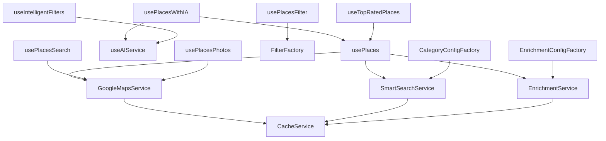

# 🗺️ Sistema de Lugares (Places) - Guía Actualizada

## 📋 Índice
1. [Introducción](#introducción)
2. [Arquitectura del Sistema](#arquitectura-del-sistema)
3. [Estructura de Carpetas](#estructura-de-carpetas)
4. [Hooks Principales](#hooks-principales)
5. [Servicios](#servicios)
6. [Configuraciones](#configuraciones)
7. [Ejemplos de Uso](#ejemplos-de-uso)
8. [Casos de Uso Comunes](#casos-de-uso-comunes)
9. [Mejores Prácticas](#mejores-prácticas)

---

## 🎯 Introducción

El sistema `@places/` es un conjunto optimizado de hooks, servicios y utilidades para gestionar lugares usando Google Places API. Proporciona búsqueda inteligente, enriquecimiento de datos y análisis con IA de forma eficiente.

### 🚀 Características Principales
- **Búsqueda inteligente** por categorías con múltiples estrategias
- **Enriquecimiento de datos** optimizado con caché
- **Análisis con IA** para filtros avanzados
- **Geolocalización** automática con fallback
- **Caché inteligente** para optimizar rendimiento
- **Configuraciones flexibles** por categoría
- **Código optimizado** siguiendo principios de clean code

---

## 🏗️ Arquitectura del Sistema



---

## 📁 Estructura de Carpetas

### 🎯 **Archivos Principales**
```
src/hooks/places/
├── index.ts                  # Exportaciones centralizadas
├── types.ts                  # Tipos e interfaces optimizadas
├── usePlaces.ts              # Hook principal optimizado
└── usePlacesWithIA.ts        # Hook con análisis de IA
```

### 🔧 **Servicios Core**
```
services/
├── GoogleMapsService.ts      # Servicio principal optimizado
├── SmartSearchService.ts     # Búsqueda inteligente unificada
├── EnrichmentService.ts      # Enriquecimiento de datos
└── CacheService.ts           # Sistema de caché en memoria
```

### ⚙️ **Configuraciones Optimizadas**
```
config/
└── categoryConfigs.ts        # Configuraciones por categoría con factory

enrichment/
└── enrichmentConfigs.ts     # Configuraciones de enriquecimiento optimizadas
```

### 🤖 **Inteligencia Artificial**
```
ai/
└── useAIService.ts           # Servicio de IA para análisis
```

### 🔍 **Filtros y Búsqueda**
```
filter/
├── filterFactory.ts          # Factory para crear filtros
├── filterStrategies.ts       # Estrategias de filtrado
└── usePlacesFilter.ts        # Hook para filtros

filters/
└── useIntelligentFilters.ts  # Filtros inteligentes con IA

search/
├── usePlacesSearch.ts        # Hook de búsqueda específica
└── searchStrategies.ts       # Estrategias de búsqueda
```

### 🖼️ **Fotos y Procesamiento**
```
photos/
└── usePlacesPhotos.ts        # Gestión de fotos de lugares

processors/
└── reviewsProcessor.ts       # Procesamiento de reviews
```

### 🛠️ **Utilidades y Base**
```
base/
├── useGoogleMaps.ts          # Hook para Google Maps
└── useGeolocation.ts        # Hook para geolocalización

utils/
└── PlaceUtils.ts            # Utilidades para lugares

topRated/
├── useTopRatedPlaces.ts     # Hook para lugares mejor valorados
└── index.ts                 # Exports del módulo
```

---

## 🎣 Hooks Principales

### 1. **`usePlaces`** - Hook Principal Optimizado

**Propósito**: Buscar lugares por categoría con enriquecimiento optimizado y manejo de errores mejorado.

```typescript
const { places, mapCenter, loading, status, error } = usePlaces({
  category: "beaches",           // Categoría de lugares
  searchQuery?: "playa bonita",  // Búsqueda específica (opcional)
  enableEnrichment?: true,      // Habilitar enriquecimiento (default: true)
  maxResults?: 20,              // Máximo de resultados (default: 20)
});
```

**Retorna**:
- `places`: Array de lugares enriquecidos optimizados
- `mapCenter`: Centro del mapa con fallback automático
- `loading`: Estado de carga
- `status`: Mensaje de estado descriptivo
- `error`: Error con mensajes específicos

**Características**:
- Carga automática de Google Maps API
- Geolocalización con fallback a ubicación por defecto
- Búsqueda unificada (nearby + text search)
- Enriquecimiento de datos con caché
- Manejo de errores optimizado

### 2. **`usePlacesWithIA`** - Hook con IA Optimizado

**Propósito**: Buscar lugares con análisis de inteligencia artificial y filtrado avanzado.

```typescript
const { places, filteredPlaces, loading, aiAnalysis, getFilteredPlaces } = usePlacesWithIA({
  category: "restaurants",
  searchQuery?: "comida peruana",
  requestedFilters: ["luxury", "beach", "petfriendly"],
  enableAI: true,
  maxPlaces: 20
});
```

**Características**:
- Análisis de IA para categorización automática
- Filtrado inteligente por características
- Callback optimizado para obtener lugares filtrados
- Integración con `usePlaces` base

### 3. **`useTopRatedPlaces`** - Hook para Top Rated

**Propósito**: Obtener lugares mejor valorados con filtros de calidad.

```typescript
const { places, loading, error } = useTopRatedPlaces({
  category: "hotels",
  minRating: 4.0,
  maxResults: 10
});
```

### 4. **`usePlacesSearch`** - Hook de Búsqueda Específica

**Propósito**: Búsqueda específica con estrategias personalizadas.

```typescript
const { places, loading, error } = usePlacesSearch({
  searchMethod: "both",        // "nearby" | "text" | "both"
  type: "restaurant",
  radius: 5000,
  searchQueries: ["comida peruana", "cevichería"]
});
```

---

## 🔧 Servicios Core

### 1. **GoogleMapsService** - Servicio Principal Optimizado
**Responsabilidad**: Gestión completa de Google Maps API con optimizaciones de rendimiento.

**Funcionalidades**:
- Carga asíncrona de Google Maps API con retry automático
- Geolocalización con fallback a ubicación por defecto
- Búsqueda nearby en múltiples radios para mayor cobertura
- Búsqueda por texto con deduplicación automática
- Formateo optimizado de resultados con validaciones
- Caché de ubicación del usuario

**Métodos principales**:
- `loadApi()`: Carga la API de forma asíncrona
- `getUserLocation()`: Obtiene ubicación con caché
- `searchNearby()`: Búsqueda por proximidad optimizada
- `searchByText()`: Búsqueda por texto
- `formatPlaceResult()`: Formateo con validaciones por categoría

### 2. **SmartSearchService** - Búsqueda Inteligente Unificada
**Responsabilidad**: Búsqueda inteligente que combina múltiples estrategias.

**Funcionalidades**:
- Búsqueda unificada (nearby + text search)
- Configuración por categoría usando `CategoryConfigFactory`
- Deduplicación automática de resultados
- Filtrado por palabras clave optimizado
- Manejo de errores robusto

**Métodos principales**:
- `searchPlaces()`: Búsqueda principal por categoría
- `performUnifiedSearch()`: Combina estrategias de búsqueda
- `deduplicateResults()`: Elimina duplicados
- `filterByKeywords()`: Filtrado optimizado

### 3. **EnrichmentService** - Enriquecimiento de Datos
**Responsabilidad**: Enriquece datos básicos con información detallada.

**Funcionalidades**:
- Enriquecimiento con campos específicos por categoría
- Configuración flexible usando `EnrichmentConfigFactory`
- Procesamiento de precios y amenities
- Manejo de rate limiting

### 4. **CacheService** - Sistema de Caché Inteligente
**Responsabilidad**: Caché en memoria para optimizar rendimiento.

**Funcionalidades**:
- TTL configurable por tipo de dato
- Gestión de estadísticas de uso
- Limpieza automática de datos expirados
- Soporte para diferentes tipos de datos

---

## ⚙️ Configuraciones Optimizadas

### **Categorías Disponibles**
```typescript
type PlaceCategory = 
  | "all" 
  | "beaches" 
  | "restaurants" 
  | "hotels" 
  | "destinations"
  | "tourist_attraction"
  | "discos"
  | "estudiar"
  | "parques";
```

### **CategoryConfigFactory** - Factory de Configuraciones
**Responsabilidad**: Proporciona configuraciones optimizadas por categoría.

**Funcionalidades**:
- Configuraciones base reutilizables (`BASE_CONFIGS`)
- Grupos de términos optimizados (`TERM_GROUPS`)
- Factory methods para acceso consistente
- Configuraciones específicas por categoría

**Métodos disponibles**:
- `getConfig(category)`: Obtiene configuración completa
- `getSearchQueries(category)`: Obtiene términos de búsqueda
- `getGoogleType(category)`: Obtiene tipo de Google Places
- `getMinRating(category)`: Obtiene rating mínimo
- `shouldEnableMultiplePhotos(category)`: Verifica si requiere fotos
- `getRadius(category)`: Obtiene radio de búsqueda

### **EnrichmentConfigFactory** - Factory de Enriquecimiento
**Responsabilidad**: Configuraciones de enriquecimiento optimizadas.

**Funcionalidades**:
- Configuración base común (`BASE_CONFIG`)
- Campos específicos por categoría
- Factory method con opciones personalizables
- Configuraciones de rate limiting y caché

### **Configuraciones por Categoría**
Cada categoría tiene configuraciones específicas optimizadas:
- **Tipo de Google Places**: Específico o genérico
- **Radio de búsqueda**: Optimizado por tipo de lugar
- **Términos de búsqueda**: Agrupados y optimizados
- **Rating mínimo**: Ajustado por categoría
- **Campos de enriquecimiento**: Específicos por tipo
- **Límites de resultados**: Configurados por categoría

---

## 📝 Ejemplos de Uso Actualizados

### 🏖️ **Ejemplo 1: Buscar Playas Optimizado**

```typescript
import { usePlaces } from '@/hooks/places';

function BeachesComponent() {
  const { places, loading, status, error } = usePlaces({
    category: "beaches",
    enableEnrichment: true,
    maxResults: 15
  });

  if (loading) return <div>{status}</div>;
  if (error) return <div>Error: {error}</div>;

  return (
    <div>
      <h2>Playas Cerca de Ti</h2>
      <p>Estado: {status}</p>
      {places.map(place => (
        <div key={place.place_id}>
          <h3>{place.name}</h3>
          <p>{place.editorial_summary?.overview}</p>
          <p>Rating: {place.rating}/5 ({place.user_ratings_total} reseñas)</p>
          
          <p>📍 {place.formatted_address}</p>
        </div>
      ))}
    </div>
  );
}
```

### 🍽️ **Ejemplo 2: Restaurantes con IA Optimizado**

```typescript
import { usePlacesWithIA } from '@/hooks/places';

function RestaurantsWithIA() {
  const { places, filteredPlaces, loading, aiAnalysis, getFilteredPlaces } = usePlacesWithIA({
    category: "restaurants",
    requestedFilters: ["luxury", "beach", "petfriendly"],
    enableAI: true,
    maxPlaces: 20
  });

  return (
    <div>
      <h2>Restaurantes Recomendados</h2>
      
      {/* Restaurantes de lujo */}
      <section>
        <h3>Restaurantes de Lujo</h3>
        {getFilteredPlaces("luxury").map(place => (
          <RestaurantCard key={place.place_id} place={place} />
        ))}
      </section>

      {/* Restaurantes pet-friendly */}
      <section>
        <h3>Pet Friendly</h3>
        {getFilteredPlaces("petfriendly").map(place => (
          <RestaurantCard key={place.place_id} place={place} />
        ))}
      </section>

      {/* Análisis de IA */}
      {aiAnalysis && (
        <div>
          <h3>Análisis de IA</h3>
          <p>Confianza general: {aiAnalysis.overall_confidence}%</p>
        </div>
      )}
    </div>
  );
}
```

### 🏨 **Ejemplo 3: Top Rated Hotels**

```typescript
import { useTopRatedPlaces } from '@/hooks/places';

function TopHotels() {
  const { places, loading } = useTopRatedPlaces({
    category: "hotels",
    minRating: 4.5,
    maxResults: 10
  });

  return (
    <div>
      <h2>Mejores Hoteles</h2>
      {places.map((place, index) => (
        <HotelCard 
          key={place.place_id} 
          place={place} 
          rank={index + 1}
        />
      ))}
    </div>
  );
}
```

### 🔍 **Ejemplo 4: Búsqueda con Configuración**

```typescript
import { usePlaces, CategoryConfigFactory } from '@/hooks/places';

function SearchComponent() {
  const [query, setQuery] = useState("");
  const [category, setCategory] = useState<PlaceCategory>("all");
  
  const { places, loading, status } = usePlaces({
    category,
    searchQuery: query,
    enableEnrichment: true
  });

  const config = CategoryConfigFactory.getConfig(category);

  return (
    <div>
      <select value={category} onChange={(e) => setCategory(e.target.value as PlaceCategory)}>
        <option value="all">Todos</option>
        <option value="beaches">Playas</option>
        <option value="restaurants">Restaurantes</option>
        <option value="hotels">Hoteles</option>
      </select>
      
      <input 
        value={query}
        onChange={(e) => setQuery(e.target.value)}
        placeholder="Buscar lugares..."
      />
      
      <p>Radio de búsqueda: {config.radius}m</p>
      <p>Rating mínimo: {config.minRating}</p>
      
      {loading && <div>{status}</div>}
      
      {places.map(place => (
        <PlaceCard key={place.place_id} place={place} />
      ))}
    </div>
  );
}
```

---

## 🎯 Casos de Uso Comunes

### 1. **Página de Categorías Optimizada**
```typescript
// Para mostrar hoteles, restaurantes, playas, etc.
const { places, loading, status } = usePlaces({ 
  category: "hotels",
  enableEnrichment: true,
  maxResults: 20
});
```

### 2. **Búsqueda con Filtros Específicos**
```typescript
// Para búsqueda con filtros específicos
const { places, loading } = usePlaces({ 
  category: "restaurants",
  searchQuery: "comida peruana",
  enableEnrichment: true
});
```

### 3. **Análisis con IA Optimizado**
```typescript
// Para análisis inteligente de lugares
const { places, filteredPlaces, getFilteredPlaces, aiAnalysis } = usePlacesWithIA({
  category: "beaches",
  requestedFilters: ["luxury", "family_friendly"],
  enableAI: true
});

// Usar callback optimizado
const luxuryBeaches = getFilteredPlaces("luxury");
```

### 4. **Top Rated con Configuración**
```typescript
// Para mostrar los mejores lugares
const { places, loading } = useTopRatedPlaces({ 
  category: "restaurants",
  minRating: 4.5,
  maxResults: 10
});
```

### 5. **Configuración Dinámica**
```typescript
// Usar configuraciones por categoría
const config = CategoryConfigFactory.getConfig("hotels");
const searchQueries = CategoryConfigFactory.getSearchQueries("restaurants");
const minRating = CategoryConfigFactory.getMinRating("beaches");
```

---

## 🏆 Mejores Prácticas Optimizadas

### ✅ **Do's**
- Usa `enableEnrichment: true` para obtener datos completos
- Implementa manejo de errores con mensajes específicos
- Usa `loading` y `status` states para mejor UX
- Aprovecha el caché automático del sistema
- Usa `CategoryConfigFactory` para configuraciones consistentes
- Implementa `getFilteredPlaces()` para filtros de IA
- Usa `maxResults` apropiado para tu caso de uso

### ❌ **Don'ts**
- No hagas demasiadas llamadas simultáneas a la API
- No ignores el manejo de errores optimizado
- No uses ubicaciones hardcodeadas sin necesidad
- No olvides limpiar estados al desmontar componentes
- No uses configuraciones hardcodeadas, usa los factories

### 🔧 **Optimizaciones Implementadas**
- **Caché inteligente**: Ubicación y resultados se cachean automáticamente
- **Búsqueda unificada**: Combina nearby + text search para mejor cobertura
- **Deduplicación**: Elimina resultados duplicados automáticamente
- **Configuraciones flexibles**: Usa factories para configuraciones consistentes
- **Manejo de errores**: Mensajes específicos por tipo de error
- **Validaciones optimizadas**: Filtros por categoría con validaciones específicas

---

## 🚀 Flujo de Trabajo Optimizado

1. **Inicialización**: El hook carga Google Maps API de forma asíncrona
2. **Geolocalización**: Obtiene ubicación del usuario con caché y fallback
3. **Configuración**: Usa `CategoryConfigFactory` para obtener configuraciones
4. **Búsqueda Unificada**: Combina nearby + text search con deduplicación
5. **Enriquecimiento**: Enriquece datos usando `EnrichmentConfigFactory`
6. **Filtrado**: Aplica filtros optimizados por categoría
7. **Retorno**: Devuelve lugares listos para mostrar con manejo de errores

---

## 📊 Estructura de Datos Optimizada

### **Place** (Básico Optimizado)
```typescript
interface Place {
  id: string;
  name: string;
  place_id: string;
  photo_url: string;
  location: LatLng;
  rating?: number;
  vicinity?: string;
  photos?: any[];
  opening_hours?: { open_now?: boolean };
}
```

### **EnrichedPlace** (Completo Optimizado)
```typescript
interface EnrichedPlace extends Place {
  formatted_address?: string;
  website?: string;
  formatted_phone_number?: string;
  editorial_summary?: { overview?: string };
  reviews?: Review[];
  types?: string[];
  lodging_info?: LodgingInfo;
  opening_hours_detailed?: OpeningHours;
  contact_info?: ContactInfo;
  ai_analysis?: AIAnalysis;
  business_status?: string;
  price_level?: number;
  user_ratings_total?: number;
  price_info?: PriceInfo;
}
```

### **LodgingInfo** (Optimizado)
```typescript
interface LodgingInfo {
  check_in_time?: string;
  check_out_time?: string;
  amenities: string[]; // Array optimizado en lugar de campos booleanos
}
```

### **ContactInfo** (Flexible)
```typescript
interface ContactInfo {
  website?: string;
  phone?: string;
  email?: string;
  social_media?: Record<string, string>; // Más flexible
}
```

---

## 🔗 Integración con Cards Optimizada

```typescript
// En tu componente de card
import { usePlaces, CategoryConfigFactory } from '@/hooks/places';

function PlacesGrid() {
  const { places, loading, status, error } = usePlaces({
    category: "beaches",
    enableEnrichment: true,
    maxResults: 20
  });

  const config = CategoryConfigFactory.getConfig("beaches");

  if (loading) return <div>{status}</div>;
  if (error) return <div>Error: {error}</div>;

  return (
    <div>
      <p>Radio de búsqueda: {config.radius}m</p>
      <div className="grid grid-cols-1 md:grid-cols-2 lg:grid-cols-3 gap-4">
        {places.map(place => (
          <BeachCard 
            key={place.place_id}
            place={place}
            onSelect={(place) => console.log('Selected:', place)}
          />
        ))}
      </div>
    </div>
  );
}
```

---

## 🎉 Conclusión

El sistema `@places/` optimizado proporciona una solución eficiente y escalable para gestionar lugares con Google Places API. Con las optimizaciones implementadas:

- **Código más limpio** siguiendo principios de clean code
- **Mejor rendimiento** con caché inteligente y búsqueda unificada
- **Configuraciones flexibles** usando factories
- **Manejo de errores robusto** con mensajes específicos
- **Estructura de datos optimizada** sin redundancias

**¡Sistema optimizado y listo para producción! 🚀**
